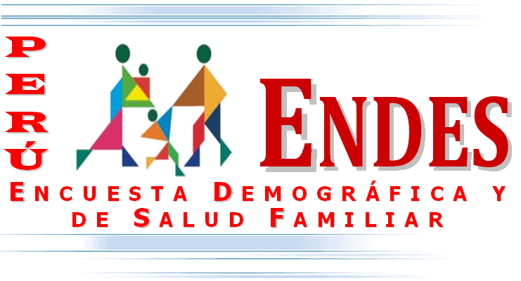
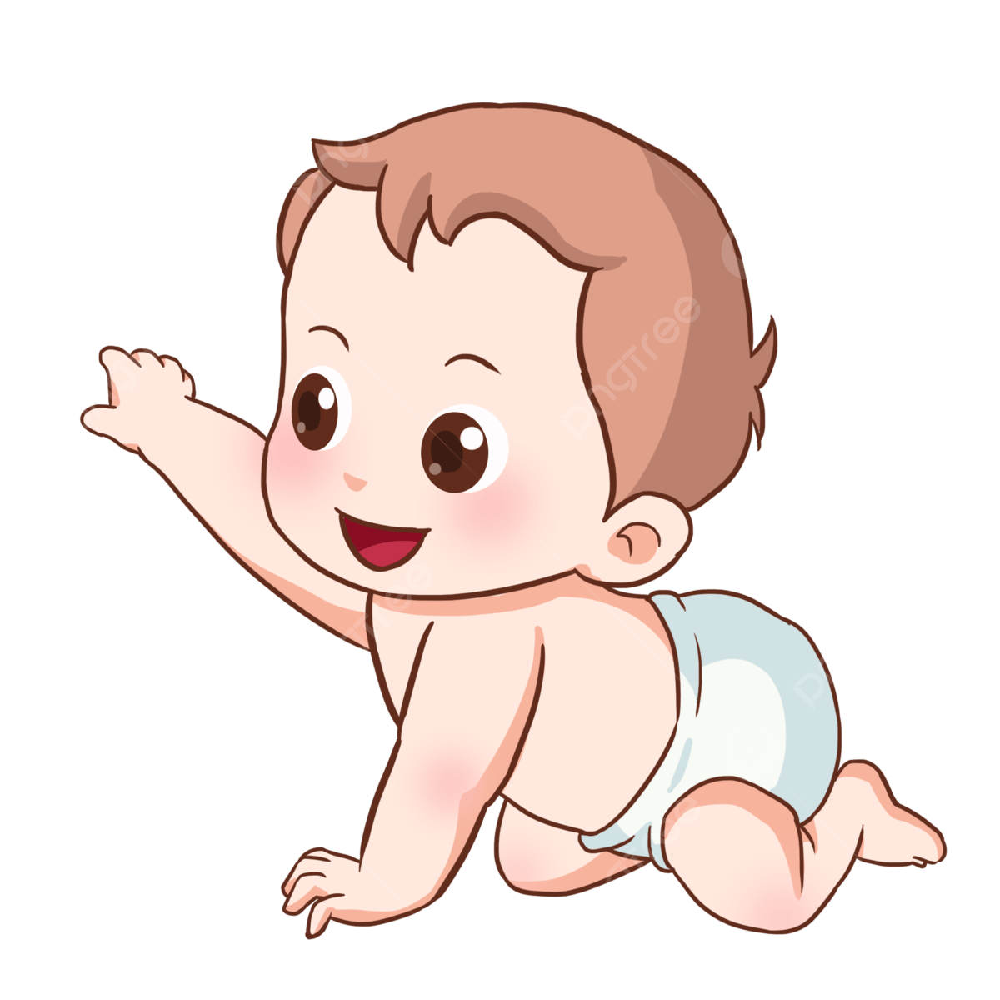
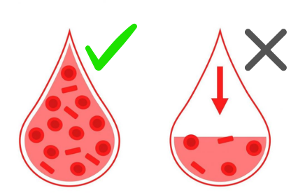
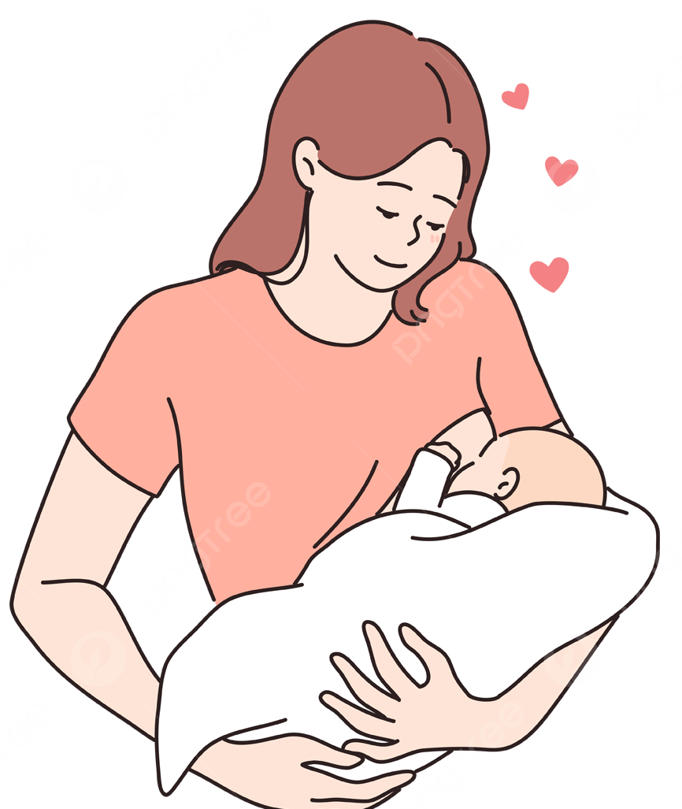
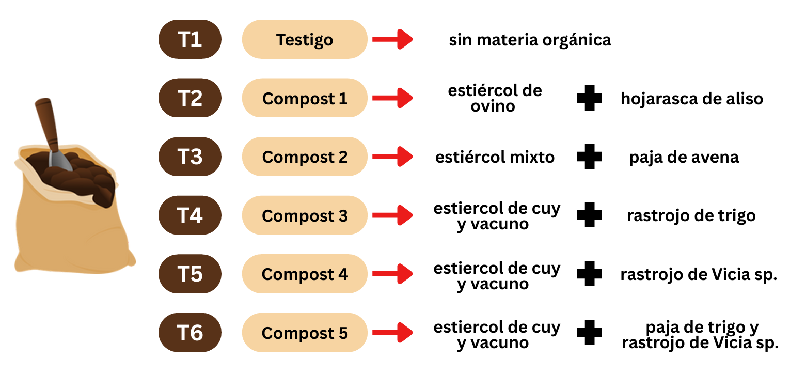

---
output:
  revealjs::revealjs_presentation:
    touch: true          # Habilita gestos táctiles
    hash: true           # Sincroniza URL (ej: #/1, #/2)
    previewLinks: true   # Permite abrir links en el mismo tab
    transition: slide    # Transición suave (mejor para Safari)
    reveal_options:
      mobileViewport: "width=device-width, initial-scale=1.0"  # Optimiza para móviles
---
```{r caratula, include=FALSE}
knitr::opts_chunk$set(echo = FALSE)
```

```{r packages, echo=FALSE}
library(htmltools)
library(htmlwidgets)
```

##  


<div style="text-align: center; padding-top: 50px;">

**TRABAJO DE INVESTIGACIÓN**

*Análisis de Regresión*  

</div>

<div style="text-align: center; font-size: 0.7em; margin-top: 20px;">

**Docente:**  
Dr. Jaime Porlas Cerrón  

**GRUPO 1**  
Integrantes: 

1. Quispe Torres, Leonardo Sebastián - 20230406  
2. Reyes Robles, Marcial Homero - 20240731  
3. Santillan Tsejem, Sergio - 20191314  
4. Saavedra Quispe, Aaron Paolo - 20230702  
5. Torres Rojas, Rodrigo Alessandro - 20230413  

</div>

<div style="text-align: center; font-size: 1.3em; margin-top: 30px; font-weight: bold;">
2025
</div>

## 1. Conjunto de datos

Articulo analizado: [Factores asociados a la duración de la lactancia materna en niños menores de 2 años en el Perú 2021-2022](https://scielo.iics.una.py//scielo.php?script=sci_arttext&pid=S2521-22812024000200213&lang=es#f3)

::::: {style="display: flex; justify-content: space-between;"}
::: {style="width: 48%;"}
```{r, out.width="100%", echo=FALSE}
    
```
:::

::: {style="width: 48%;"}
```{r, out.width="80%", echo=FALSE}
    
```
:::
:::::

## 2. Criterios analizados

```{r setup, include=FALSE}
knitr::opts_chunk$set(echo = FALSE)

```

<style> .image-grid { display: grid; grid-template-columns: repeat(2, 1fr); gap: 20px; text-align: center; } .image-container { margin-bottom: 20px; } .image-title { font-weight: bold; margin-bottom: 10px; } </style><div class="image-grid"> <!-- Fila 1 --> <div class="image-container"> <div class="image-title">Bebés <24 meses </div>  </div> <div class="image-container"> <div class="image-title">Sin anemia </div>  </div> <!-- Fila 2 --> <div class="image-container"> <div class="image-title">Amamantamiento de 6-24 meses</div>  </div> <div class="image-container"> <div class="image-title">Contacto piel a piel</div>  </div></div>

## 3. Variables del estudio 


## 3. Variables del estudio
### Tratamientos de compost de prueba
```{r trat, out.width="100%", echo=FALSE}
    
```

```{r sync-safari, echo=FALSE}
htmltools::tagList(
  htmltools::tags$script(HTML("
    // Sincronización manual para Safari
    if(window.location.search.includes('control')) {
      setInterval(() => {
        const currentSlide = window.location.hash;
        window.opener.postMessage({ type: 'slide', hash: currentSlide }, '*');
      }, 500);
    }
  "))
)
```